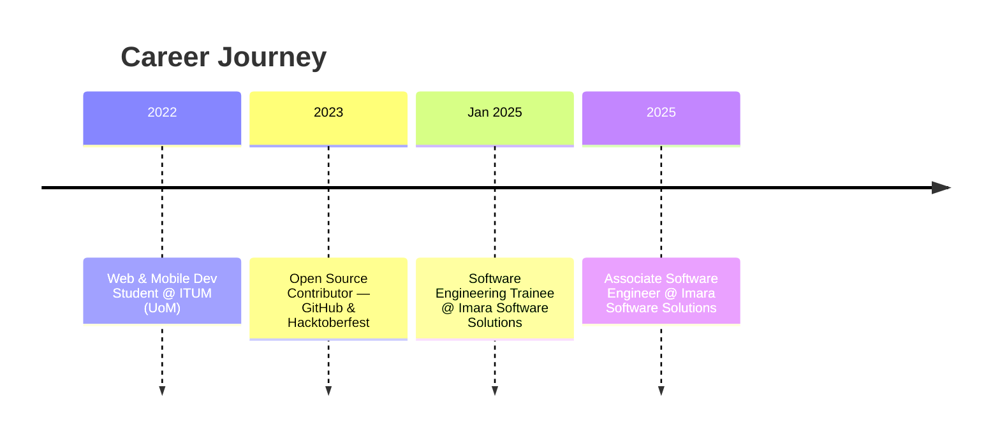

<p align="center">
  
</p>

<div align="center">

<!--  -->


<br/>


<br/>

[](https://github.com/Fathir2001)
[](https://linkedin.com/in/rifthan-fathir)
[](mailto:rifthanfathir33@gmail.com)
[](https://instagram.com/rifthan_fathir)

</div>

<br/>

## 🐍 Snake Contribution


## 🌟 About Me


- 🎓 **NTD in Information Technology** — *Institute of Technology, University of Moratuwa*
- 💼 **Associate Software Engineer** @ **Imara Software Solutions (Pvt) Ltd** — building impactful, scalable software solutions
- 🖥️ Passionate about **Full Stack Development**
- 🎨 Strong interest in **UI/UX Design & Motion Animations**
- 🔭 Always exploring modern technologies and best practices
- 🌱 Currently leveling up: **Flutter animations**, **system design**, and **cloud infra**
- ⚡ Fun fact: I like turning ideas into products people actually *use*
- 📬 Reach me at **rifthanfathir33@gmail.com**

<br clear="right"/>


## 🧠 Currently Working On


```text
🔧  Shipping production features at Imara Software Solutions
🚀  Building TrekTempo — a real-world Sri Lankan travel platform
🎨  Polishing UI/UX with animations & micro-interactions
```

<br clear="right"/>


## 🧩 Strengths Snapshot

<div align="center">

| 🧼 Clean Code | 🎨 UI/UX Sense | 🔗 REST APIs | 🤝 Team & Agile | 🧠 Problem Solving |
|:---:|:---:|:---:|:---:|:---:|
| Maintainable & scalable | Design-driven builds | Robust integrations | Cross-functional collab | Practical, real solutions |

</div>


## 🧰 Tech Stack

<div align="center">

**Languages & Frameworks**
<br/>


**Data & Cloud**
<br/>


**Tools & Design**
<br/>


</div>


## 💼 Experience Timeline




## 📂 Featured Projects

<table>
<tr>
<td width="50%">

### 🧭 TrekTempo
A Sri Lankan travel & community app featuring events, places, and user-generated content.
<br/>
**Flutter · Node.js · Express · MongoDB**
<br/>
📱 Mobile App + 🖥️ Admin Panel

</td>
<td width="50%">

### ☁️ Restaurant Ordering App
Live ordering system with authentication, real-time cart, and email notifications.
<br/>
**React.js · Firebase (Auth, Firestore, Functions)**

</td>
</tr>
<tr>
<td width="50%">

### ☀️ EcoRoute — IoT Weather Monitor
Real-time environmental monitoring with sensor data visualization.
<br/>
**ESP32 · Arduino · DHT11 · BMP180 · GPS · Mobile Dashboard**

</td>
<td width="50%">

### 🛒 R.F Grocery App
Clean, categorized, smooth-navigation mobile grocery app.
<br/>
**Flutter**

</td>
</tr>
<tr>
<td width="50%">

### 💡 Inspirella
Minimalist quote generator delivering daily inspiration.
<br/>
**Flutter**

</td>
<td width="50%">

### 🔗 More Projects
Explore the full collection of builds & experiments.
<br/>
<a href="https://github.com/Fathir2001?tab=repositories">👉 View Repositories</a>

</td>
</tr>
</table>


## 🎯 Goals for 2025

- [ ] 🚀 Launch **TrekTempo** on the Play Store
- [ ] 📂 Build a personal portfolio with animations & case studies
- [ ] 🤝 Contribute to 10+ open source projects
- [ ] 💼 Secure a full-time software engineering role after graduation


## 📊 GitHub Analytics

<div align="center">
  
  
</div>

<div align="center">
  
  
</div>

<div align="center">

[](https://github.com/Fathir2001)

</div>


## 🏅 Badges & Recognition

<p align="center">
  
</p>

<p align="center">
  <a href="https://github.com/Fathir2001?tab=repositories&sort=stargazers">
    
  </a>
  <a href="https://github.com/Fathir2001?tab=followers">
    
  </a>
</p>


## 🌐 Let's Connect

<div align="center">

[](https://linkedin.com/in/rifthan-fathir)
[](https://www.facebook.com/profile.php?id=61558667296396)
[](https://instagram.com/rifthan_fathir)
[](mailto:rifthanfathir33@gmail.com)

</div>

<div align="center">


</div>


